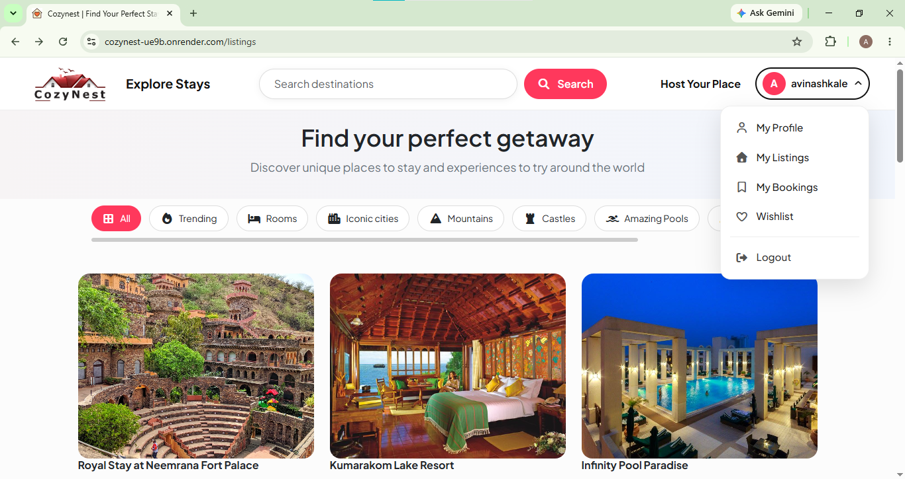

# 🏡 CozyNest

**CozyNest** is a full-stack accommodation and stay-booking web application that allows users to discover unique stays, view detailed property information, save favourite listings, make bookings, and share reviews.

The project was built to practice and demonstrate full-stack web development using Node.js, Express.js, MongoDB, EJS, authentication, cloud image storage, maps, and responsive UI design.

---

## 🌐 Live Demo

🔗 **Live Website:**  
https://cozynest-ue9b.onrender.com

## 📸 Project Preview

### 🏠 Listings Page


### 🏡 Listing Details


### 🔐 Login Page


### 📅 Booking


### ❤️ Wishlist


### 📱 Mobile Responsive


---

## ✨ Features

### 👤 User Authentication
- User registration
- User login and logout
- Passport Local authentication
- Session-based authentication
- Protected routes
- Authorization for user-specific actions

### 🏡 Listings
- Browse available stays
- View detailed listing pages
- Create new listings
- Edit owned listings
- Delete owned listings
- Upload listing images
- Listing ownership authorization
- Search listings
- Category-based listing filtering

### ❤️ Wishlist
- Add listings to wishlist
- Remove listings from wishlist
- View saved stays
- Wishlist management from user profile

### 📅 Booking System
- Select check-in date
- Select check-out date
- Select number of guests
- Validate booking dates
- Confirm bookings
- View booking history
- Cancel bookings

### ⭐ Reviews & Ratings
- Add reviews
- Give star ratings
- Display guest reviews
- Show review authors

### 🗺️ Maps & Location
- Interactive MapTiler maps
- Display listing locations
- Location-based map markers
- Geocoding for listing destinations

### 👤 User Profile
- View user profile
- View account activity
- My Listings
- My Bookings
- Wishlist

### 📱 Responsive UI
- Desktop responsive layout
- Tablet responsive layout
- Mobile responsive layout
- Responsive navigation
- Responsive listing cards
- Responsive booking forms
- Mobile-friendly authentication pages

---

## 🛠️ Tech Stack

### Frontend
- HTML5
- CSS3
- JavaScript
- Bootstrap 5
- EJS

### Backend
- Node.js
- Express.js
- EJS Mate

### Database
- MongoDB
- Mongoose

### Authentication
- Passport.js
- Passport Local Strategy
- Express Session
- Connect Flash

### Cloud & APIs
- Cloudinary — image storage
- MapTiler — maps and geocoding

### Development Tools
- VS Code
- Git
- GitHub
- Nodemon
- Render

---

## 🏗️ Project Structure

```text
CozyNest/
│
├── controllers/
│   ├── bookings.js
│   ├── listings.js
│   ├── users.js
│   └── wishlist.js
│
├── models/
│   ├── booking.js
│   ├── listing.js
│   ├── review.js
│   └── user.js
│
├── routes/
│   ├── bookings.js
│   ├── listing.js
│   ├── review.js
│   ├── user.js
│   └── wishlist.js
│
├── views/
│   ├── bookings/
│   ├── listings/
│   ├── users/
│   ├── includes/
│   └── layouts/
│
├── public/
│   ├── css/
│   ├── js/
│   └── images/
│
├── utils/
│
├── middleware.js
├── schema.js
├── cloudConfig.js
├── app.js
├── package.json
├── package-lock.json
└── README.md
```

---

## ⚙️ Installation & Setup

### 1. Clone the repository

```bash
git clone https://github.com/avinashkale14/CozyNest.git
```

### 2. Navigate to the project

```bash
cd CozyNest
```

### 3. Install dependencies

```bash
npm install
```

### 4. Create `.env`

Create a `.env` file in the root directory.

```env
DB_URL=your_mongodb_connection_string
SECRET=your_session_secret

CLOUD_NAME=your_cloudinary_cloud_name
CLOUD_API_KEY=your_cloudinary_api_key
CLOUD_API_SECRET=your_cloudinary_api_secret

MAPTILER_KEY=your_maptiler_api_key
```

> Never commit your `.env` file to GitHub. Keep database credentials, API keys, and secrets private.

### 5. Start the application

```bash
node app.js
```

For development with Nodemon:

```bash
npm run dev
```

### 6. Open the application

```text
http://localhost:8080/listings
```

---

## 🔄 Application Flow

```text
User
  ↓
Register / Login
  ↓
Browse Listings
  ↓
Search / Category Filter
  ↓
View Listing
  ↓
 ┌───────────────┬───────────────┐
 ↓               ↓               ↓
Wishlist        Booking         Review
 ↓               ↓               ↓
Save Stay       Reserve         Rating
 ↓               ↓               ↓
Profile ←────────┴───────────────┘
```

---

## 🔐 Authentication & Authorization

CozyNest uses Passport.js and Express sessions for authentication.

Protected functionality includes:

- Creating listings
- Editing listings
- Deleting listings
- Booking stays
- Managing wishlist
- Adding reviews

Listing ownership is also verified before allowing edit or delete operations.

---

## 🗺️ Location & Image Services

### Cloudinary

Cloudinary is used to store listing images uploaded by users.

### MapTiler

MapTiler is used for:

- Interactive maps
- Listing location markers
- Forward geocoding
- Displaying property locations

---

## ☁️ Deployment

The application is deployed using **Render**.

```text
GitHub
   ↓
Render
   ↓
Node.js + Express
   ↓
MongoDB
   ↓
Cloudinary + MapTiler
```

### Deployment Environment

The production application uses environment variables for:

- MongoDB connection
- Session secret
- Cloudinary credentials
- MapTiler API key

---

## 🎯 Key Learning Outcomes

Through CozyNest, I gained practical experience in:

- Building a full-stack MVC web application
- Express.js routing and middleware
- CRUD operations
- MongoDB database management with Mongoose
- Authentication with Passport.js
- Authorization and protected routes
- Session management
- Image upload and cloud storage
- Interactive maps and geocoding
- Booking workflows
- Wishlist functionality
- Reviews and ratings
- Responsive UI design
- Git and GitHub
- Deployment with Render

---

## 🚀 Future Improvements

Possible future improvements:

- Online payment integration
- Advanced search and sorting
- Property availability calendar
- Booking conflict prevention
- Email notifications
- Admin dashboard
- User profile image upload
- Advanced property filtering
- Improved booking management

---

## 👨‍💻 Developer

### Avinash Kale
**Bachelor of Computer Science**

GitHub:  
https://github.com/avinashkale14

---

## 📄 License

This project was developed for educational, portfolio, and learning purposes.